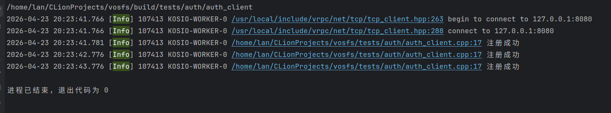
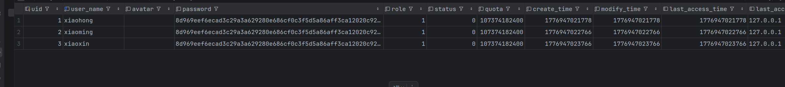
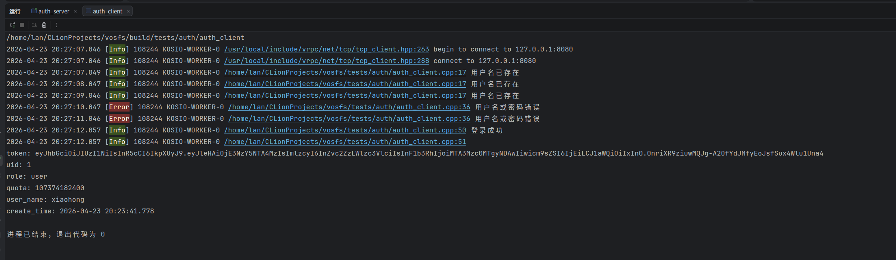
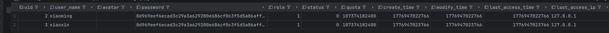

## RPC 认证服务模块

此模块使用 SQLite 存储用户信息，提供登录、注册、注销等基础功能，服务器端使用 JWT token 对用户的 RPC 调用进行校验，目前暂未实现 UI 界面，下面是简单的功能测试以及源码

启动服务器和客户端，并进行一些登录注册注销操作

我们先注册三个用户





接着让其中的用户 xiaohong 登陆成功，其他失败，但是注册的命令不删除



尝试从数据库注销登录的 xiaohong



由于条件限制，目前只在本地回环测试


**源码**

服务端

```c++
#include <kosio/signal/signal.hpp>
#include "vosfs/auth/auth_server.hpp"
using namespace vosfs::auth;

auto main() -> int {
    SET_LOG_LEVEL(kosio::log::LogLevel::Verbose);
    auto has_auth_server = AuthNode::create("test.db", 8080);
    if (!has_auth_server) {
        LOG_ERROR("{}", has_auth_server.error());
        return -1;
    }
    auto auth_server = std::move(has_auth_server.value());
    auth_server->wait();
}
```


客户端

```c++
#include "vosfs/auth/auth_client.hpp"
using namespace vosfs::auth;

class AuthClient : public BaseClient<AuthClient> {
    friend class BaseClient<AuthClient>;
public:
    explicit AuthClient(std::string_view server_ip, uint16_t server_port)
        : BaseClient<AuthClient>(server_ip, server_port) {}

private:
    void handle_register_user_response(const vrpc::Status& status, const RegisterUserResponse& response) {
        if (!status.ok()) {
            LOG_ERROR("{}", status.message());
            return;
        }

        LOG_INFO("{}", response.message());
    }
    void handle_delete_user_response(const vrpc::Status& status, const DeleteUserResponse& response) {
        if (!status.ok()) {
            LOG_ERROR("{}", status.message());
            return;
        }

        LOG_INFO("{}", response.message());
    }

    void handle_login_user_by_name_response(const vrpc::Status& status, const LoginUserByNameResponse& response) {
        if (!status.ok()) {
            LOG_ERROR("{}", status.message());
            return;
        }

        auto login_status = Status{response.status_code()};
        if (!login_status.ok()) {
            LOG_ERROR("{}", response.message());
            return;
        }

        session_.token = response.token();
        auto decoded = jwt::decode(session_.token);
        session_.uid = std::stoll(decoded.get_payload_claim("uid").as_string());
        session_.role = static_cast<User_Role>(std::stoi(decoded.get_payload_claim("role").as_string()));
        session_.quota = std::stoull(decoded.get_payload_claim("quota").as_string());
        session_.user_name = response.user_name();
        session_.avatar = response.avatar();
        session_.create_time = response.create_time();

        auto role_str = session_.role == User_Role_kAdmin ? "admin" : "user";
        LOG_INFO("{}", response.message());
        LOG_INFO("\ntoken: {}\nuid: {}\nrole: {}\nquota: {}\nuser_name: {}\ncreate_time: {}",
            session_.token,
            session_.uid,
            role_str,
            session_.quota,
            session_.user_name,
            session_.create_time);
    }
};

auto main_loop() -> kosio::async::Task<void> {
    auto auth_client = AuthClient{"127.0.0.1", 8080};
    int n{1};
    while (n > 0) {
        --n;
        co_await auth_client.send_register_user_request("xiaohong", "123456", User_Role_kUser);
        co_await kosio::time::sleep(1000);
        co_await auth_client.send_register_user_request("xiaoming", "123456", User_Role_kUser);
        co_await kosio::time::sleep(1000);
        co_await auth_client.send_register_user_request("xiaoxin", "123456", User_Role_kUser);
        co_await kosio::time::sleep(1000);
        co_await auth_client.send_login_user_by_name_request("xiaoming", "111111", User_Role_kUser);
        co_await kosio::time::sleep(1000);
        co_await auth_client.send_login_user_by_name_request("xiaoming", "123456", User_Role_kAdmin);
        co_await kosio::time::sleep(1000);
        co_await auth_client.send_login_user_by_name_request("xiaohong", "123456", User_Role_kUser);
        co_await kosio::time::sleep(1000);
        co_await auth_client.send_delete_user_request("123456");
        co_await kosio::time::sleep(1000);
        // co_await auth_client.send_login_user_by_name_request("xiaoming", "123456", User_Role_kUser);
    }
}

auto main() -> int {
    kosio::runtime::CurrentThreadBuilder::default_create().block_on(main_loop());
}
```

